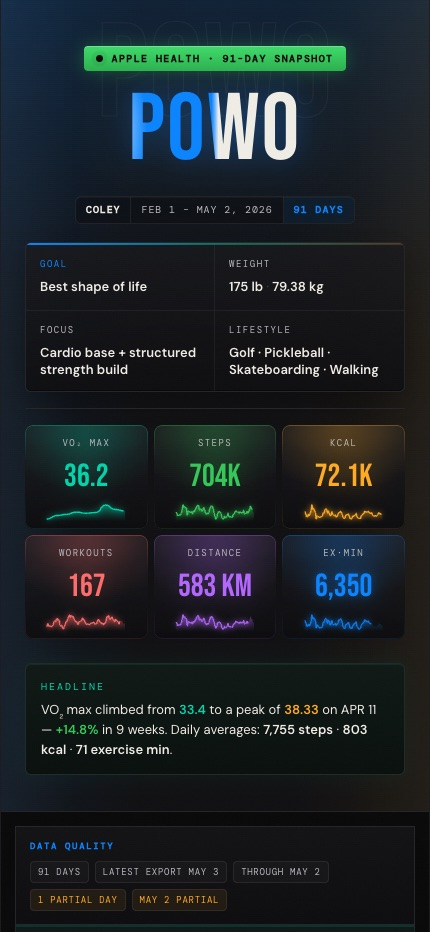

<div align="center">

# POWO — Proof of Workout

**A mobile-first fitness dashboard that turns 91 days of Apple Health data into a cinematic, editorial-grade interface.**

Zero UI libraries. Every card, chart, animation, and visualization — built from scratch.

[**Live →**](https://proof-of-workout-next.vercel.app)
&nbsp;·&nbsp;
[Tech Stack](#tech-stack)
&nbsp;·&nbsp;
[Design Decisions](#design-decisions)
&nbsp;·&nbsp;
[What This Demonstrates](#what-this-demonstrates)

</div>

<div align="center">



</div>

---

## The Product

POWO ingests 91 days of Apple HealthKit data for a single athlete and renders it across sixteen composed sections: a hero KPI grid with per-metric sparklines, a data-quality and coach-takeaway strip, a 14-day calorie burn chart, period totals, week-over-week deltas, a daily breakdown table, a VO₂ max trajectory chart, cardiac metrics, sleep-stage analysis, a workout library, a pushup log, rest and training recommendations, achievements, and an Apple Health verification footer.

The experience is **mobile-first** — a dark-mode column tuned pixel-by-pixel for a 375 px iPhone viewport — and now **responsive across three breakpoints**: the phone column stays exactly as designed, an iPad layout (≥641 px) widens the column and reflows the metric grids, and a desktop layout (≥1024 px) becomes a true dashboard with a sticky left-rail navigation and a two-column section canvas. It runs entirely statically — no client-side data fetching, no runtime API.

## Tech Stack

| Layer            | Choice                                           |
| ---------------- | ------------------------------------------------ |
| Framework        | **Next.js 16** (App Router, static generation)   |
| Language         | **TypeScript**, strict types end-to-end          |
| Styling          | **Tailwind CSS v4** via `@theme` design tokens   |
| Animation        | **Framer Motion** — scroll-triggered reveals, path draw-ons, motion.path |
| Icons            | **Custom monoline SVG system** — no icon library |
| Charts           | **Hand-rolled SVG** — no charting library        |
| Deployment       | **Vercel** — push-to-`main` auto-deploy         |
| CI               | **GitHub Actions** — lint, test, typecheck, build |

## Design Decisions

**No UI library.** Every surface is written in plain React with inline styles driven by CSS custom-property tokens. `globals.css` defines the full design system: colors, shadows, motion utilities, glow helpers, and registered `@property` animations. No shadcn, no Radix, no Chakra.

**No charting library.** The VO₂ trajectory uses `motion.path` with `pathLength` for a draw-on reveal, a unified horizontal "story gradient" fill (teal → amber → coral), and a vertical light beam pinned at the personal record. Cardiac sparklines are hand-rolled SVG polylines. Sleep stages are stacked `rect` elements. Most chart components stay under 220 lines; `VO2Chart` is the exception at ~300, since it inlines gradients, beams, dots, and labels in one file.

**Custom SVG icon system.** A monoline set (`IconWalking`, `IconDumbbell`, `IconHeartPulse`, …) — each a 20×20 viewBox, `stroke="currentColor"`, `strokeWidth=1.5`. A factory `base()` function enforces accessibility defaults: `role="img"` + `aria-label` when labeled, `aria-hidden` when decorative.

**Cinematic visual language.** Six registered `@property` CSS animations drive the design system:
- `--ambient-tint` — the full-page backdrop glow transitions color in 900ms as the user scrolls between sections
- `--shine-x` — a radial sheen sweeps across the POWO wordmark every 7s
- `.powo-trophy` — each KPI tile carries a per-accent radial halo and gradient accent border
- `.powo-comet` — every progress bar has a bright leading-edge gradient that fades to white at the tip
- `motion.path pathLength` — VO₂ lines draw themselves on scroll entry
- Animated area fill with `opacity` reveal on the VO₂ chart

**Six-color accent palette with tinting.** Base blue `#0a84ff`, extended with green, coral, amber, purple, and teal. Each KPI, cardiac metric, award, and WoW tile is mapped to one accent and tinted throughout: sparkline fill, radial halo, gradient border, text glow.

**Mobile-first, then responsive.** The phone is the design's source of truth — the base layer carries no media queries, so it can never drift. iPad and desktop layers are purely additive `@media` overrides (≥641 px, ≥1024 px): the column widens, equal-column grids gain columns, and on desktop the navigation becomes a left rail while sections tile into a two-column canvas. A local Playwright visual-regression check (`npm run test:visual`) guards the 390 px phone render pixel-for-pixel against every layout change.

**Static data, real data.** `lib/data.ts` composes a source-controlled base snapshot with the latest curated import patch from `lib/imported-health-export.ts` via `lib/normalize-health-export.ts`. No API, no database, no client-side data fetch.

## Features

- **16 composed sections** — Hero, Data Quality + Coach Takeaway, 14-Day Burn, Period Summary, WoW Delta, Daily Breakdown, VO₂ Trajectory, Cardiac Metrics, Sleep Analysis, Workout Library, Top Sessions, Pushup Log, Rest Recommendation, Training Plan, Achievements, Footer
- **Stat trophy tiles** — hero KPIs each get a sparkline, radial halo, gradient accent border, and count-up animation
- **VO₂ story gradient** — single horizontal fill transitions green (rise) → amber (peak) → coral (decline), with animated draw-on lines and a pulsing PR dot
- **Ambient backdrop tinting** — the page background glow reacts to whichever section is in view, animating via `@property --ambient-tint`
- **Comet-tipped bars** — every progress bar in the app (workout types, weekly heatmap, pushup log, daily step bars) uses a white-tipped gradient with glow
- **POWO wordmark shimmer** — animated `@property --shine-x` radial sheen sweeps across the blue/white text split
- **Scroll-triggered sparklines** — `Sparkline.tsx` draws animated paths on viewport entry across 6 KPI tiles and all 6 cardiac metric cards
- **Activity-aware workout log** — top 6 sessions sorted by calorie burn, each with its SVG icon and per-activity color
- **14-day daily breakdown table** — comet step bars, per-row color highlights for leaders
- **Null-safe cardiac sparklines** — days missing wrist-data render cleanly
- **Week-over-week delta tiles** — 5 per-metric cards with trophy treatment and directional color coding
- **Apple Health verified badge** — live pulse dot, every data point traceable to HealthKit
- **Dynamic OG image** — generated at build via `next/og` for link previews
- **Custom 404 and error boundary** — on-brand, recoverable
- **prefers-reduced-motion respected** — all CSS keyframes and Framer Motion transitions guarded

## What This Demonstrates

- **Component architecture without a framework.** Small typed components with clear rendering responsibilities and shared data helpers.
- **Data visualization from primitives.** Polylines, paths, gradients, `motion.path`, stacked rects — zero chart libraries.
- **Design-system thinking.** CSS `@property` registered animations, six-color accent palette, typography stack (Bebas Neue / DM Sans / DM Mono), consistent spacing.
- **Accessibility.** Semantic HTML, ARIA on every icon, structured table markup, `prefers-reduced-motion` guards on every animation.
- **Performance.** Fully static output, no client-side data fetch, and no icon library bundle.
- **Production telemetry.** Vercel Web Analytics + Speed Insights for real-user metrics in Vercel deployments.
- **Web standards.** PWA manifest, sitemap, robots.txt, and JSON-LD structured data — all generated at build time.
- **Shipping discipline.** MIT license, CI on PR, error boundaries, custom not-found, OG image, rich metadata.

## Local Development

### Requirements

- Node.js **22.x** (matches `.nvmrc` and CI)
- npm
- Network access for first production builds, because `next/font/google` downloads and self-hosts the Google font files during `next build`

```bash
git clone https://github.com/coleyrockin/POWO.git
cd POWO
npm ci
npm run dev
```

Open [http://localhost:3000](http://localhost:3000).

No environment variables are required. `.env.example` is included as a setup contract for reviewers.

### Scripts

| Command           | Effect                                    |
| ----------------- | ----------------------------------------- |
| `npm run dev`     | Start Next dev server                     |
| `npm run build`   | Production build (static)                 |
| `npm run start`   | Serve production build                    |
| `npm run preview` | Build, then serve the production app      |
| `npm run lint`    | ESLint (Next.js config)                   |
| `npm run test`    | Regression test for health export normalization |
| `npm run test:visual` | Local visual-regression check at 390 / 820 / 1280 px (freezes the phone render) |
| `npm run test:visual:update` | Recapture visual baselines after an intended layout change |
| `npm run typecheck` | Typecheck without emitting files        |
| `npm run audit:prod` | Audit production dependencies only     |
| `npm run verify`  | Lint, test, typecheck, and production build |
| `npm run smoke`   | Start the built app and verify routes, metadata, headers, and 404 |
| `npm run smoke:build` | Build, then run production smoke     |
| `npm run qa`      | Full release gate: verify, production audit, and smoke |

### Release Check

Before pushing public-facing changes:

```bash
npm run qa
```

The smoke gate serves the existing `.next` build on port `3010` and verifies `/`, `/manifest.webmanifest`, `/robots.txt`, `/sitemap.xml`, `/opengraph-image`, `/twitter-image`, security headers, and the custom 404. Use `POWO_SMOKE_PORT=4010 npm run smoke` if port `3010` is busy.

Then inspect the mobile shell at 375 px, 390 px, 430 px, and desktop width. See [`docs/RELEASE_CHECKLIST.md`](docs/RELEASE_CHECKLIST.md) for the full public/recruiter/deployment checklist.

## Deployment

The `main` branch deploys to Vercel at [proof-of-workout-next.vercel.app](https://proof-of-workout-next.vercel.app).

- Build command: `npm run build`
- Install command: `npm ci`
- Environment variables: none required
- Runtime: static App Router output with Vercel Analytics and Speed Insights enabled on Vercel

## Project Structure

```
app/
  layout.tsx              Root layout, fonts, metadata, viewport
  page.tsx                Composition of all sixteen sections
  globals.css             Design system — tokens, @property animations, utilities
  opengraph-image.tsx     Dynamic OG image (next/og)
  twitter-image.tsx       Re-export of OG for Twitter cards
  manifest.ts             PWA manifest route
  robots.ts               Crawl policy route
  sitemap.ts              Sitemap route
  error.tsx               Error boundary
  not-found.tsx           Custom 404

components/
  Hero.tsx                Header KPIs, trophy tiles, wordmark shimmer
  HealthCommandStrip.tsx  Data quality chips + coach takeaway
  ActivityRings.tsx       14-day calorie burn bar chart
  WeeklySummary.tsx       Period totals + heatmap
  WeekChange.tsx          Week-over-week delta tiles
  DailyTable.tsx          14-day daily breakdown table
  VO2Chart.tsx            VO₂ trajectory (SVG, Framer Motion)
  CardiacMetrics.tsx      RHR, HRV, walking HR sparklines
  SleepAnalysis.tsx       Sleep stage stacked bars
  WorkoutLog.tsx          Activity breakdown + top sessions
  PushupLog.tsx           Weekly pushup volume log
  RestRecommendation.tsx  AI-driven recovery protocol
  WorkoutRecommendation.tsx  7-day training plan
  Awards.tsx              Achievement highlight cards
  Footer.tsx              Apple Health verification + wordmark
  Sparkline.tsx           Reusable animated sparkline (SVG + Framer Motion)
  SectionHeader.tsx       Labelled section divider with accent tick
  SectionNav.tsx          Sticky scroll-linked section navigation
  ScrollProgress.tsx      Rainbow scroll progress bar
  CountUp.tsx             Viewport-triggered count-up animation

lib/
  types.ts                Typed dashboard data model
  data.ts                 Base snapshot + normalized export composition
  imported-health-export.ts  Curated latest import patch
  normalize-health-export.ts Data normalization and recomputation
  helpers.ts              Stat helpers, recovery engine, weekly aggregates
  site.ts                 Shared site metadata constants
  icons.tsx               SVG icon components + activity color maps

scripts/
  normalize-health-export.test.mts  Normalizer regression coverage
  smoke-production.mjs        Production route/header/metadata smoke gate

.github/workflows/ci.yml  Lint, test, typecheck, build on PR
docs/RELEASE_CHECKLIST.md  Public/release verification checklist
SECURITY.md               Vulnerability reporting policy
.env.example              Explicit no-required-env setup contract
.nvmrc                    Local Node version hint
```

## License

MIT © Coley Roberts

## Documentation status and planning

This repository’s planning and execution guidance is documented in [`ROADMAP.md`](./ROADMAP.md).

### Current project status

- **Shipped**: Static dashboard implementation with multiple health and training views, Next.js app structure, and existing CI/smoke pipeline.
- **In progress / planned**: Documentation consolidation, roadmap hygiene, and broader quality hardening (as described in the roadmap).
- **Constraints**: This repository is intentionally scoped in this phase to planning and documentation improvements before new feature development.

### Repo workflow notes

- Primary scripts: `npm run lint`, `npm run typecheck`, `npm run test`, `npm run build`, `npm run smoke`.
- See `ROADMAP.md` for the recommended first-agent execution order, verification expectations, and tests/checks for each step.
- For feature planning, keep shipped work and planned work clearly separated in all future updates.
