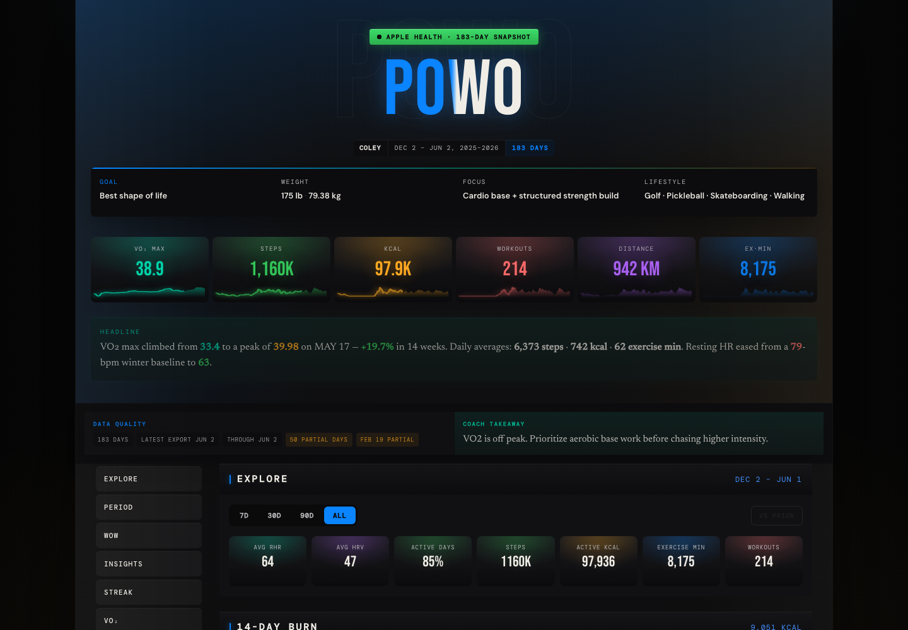
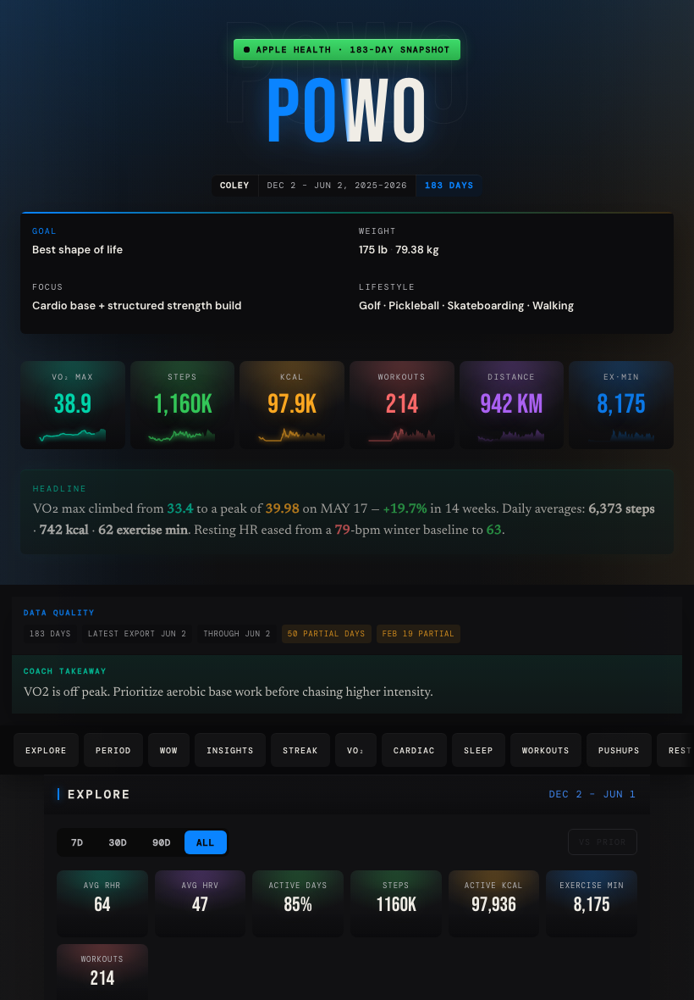
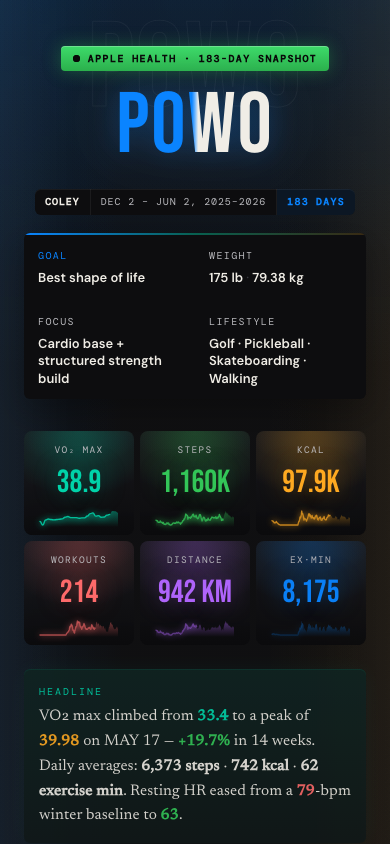

# POWO — Proof of Workout

Coley's 6-month Apple Health export, turned into a living, editorial-grade training record.

[**Live →**](https://proof-of-workout-next.vercel.app)

---

## Dashboard

<p align="center">
  
</p>

<table>
  <tr>
    <td width="68%">
      
    </td>
    <td width="32%">
      
    </td>
  </tr>
</table>

The same dashboard is deliberately composed for desktop, iPad, and iPhone rather than merely scaled between them.

---

## What it is

A personal site, not a product. POWO takes raw Apple Health data — 183 days, 214 workouts, 57 nights of sleep, a resting heart rate that dropped 16 bpm — and renders it as something worth looking at. Every chart, card, and line of copy is specific to one athlete's real numbers.

The technical choices serve that goal: no UI library because every surface needs to look exactly right; no charting library because the data tells a specific story; static output because the page should load in under a second on a phone with bad signal.

---

## Installation

Requires Node 22.x.

```bash
git clone https://github.com/coleyrockin/POWO.git
cd POWO
npm ci
npm run dev
```

No environment variables required. The data ships as a committed TypeScript module.

---

## Usage

```bash
npm run dev          # local dev server → localhost:3000
npm run refresh      # ingest a new Apple Health export, run the full gate
npm run qa           # full release gate: lint + test + typecheck + build + audit + smoke
npm run preview      # build then serve the production output locally
npm run screenshots:readme # rebuild and refresh the responsive README gallery
```

### Refreshing the data

Export from the Apple Health app (Profile → Export All Health Data), place the JSON at the path in `scripts/convert-export.mjs`, then:

```bash
npm run refresh
git push origin main
```

Vercel picks it up. The site rebuilds in about a minute.

### Scripts

| Command | What it does |
|---|---|
| `npm run dev` | Start dev server |
| `npm run build` | Production build (fully static) |
| `npm run lint` | ESLint |
| `npm run test` | Normalizer + insights + consistency tests |
| `npm run typecheck` | TypeScript strict check, no emit |
| `npm run verify` | lint + test + typecheck + build |
| `npm run audit:prod` | Dependency audit (prod-only) |
| `npm run smoke` | Verify routes, metadata, and headers against the built output |
| `npm run screenshots:readme` | Rebuild and capture desktop, iPad, and iPhone README images |
| `npm run qa` | Full gate — run before every push |
| `npm run refresh` | Convert new export → run qa |

---

## Tech Stack

| | |
|---|---|
| Framework | Next.js 16.2, App Router, fully static (SSG) |
| Language | TypeScript strict |
| Styling | Tailwind v4 via `@theme` tokens, LightningCSS |
| Animation | Framer Motion 12 — LazyMotion + `m` component |
| Charts | Hand-rolled SVG — no charting library |
| Icons | Custom monoline SVG set in `lib/icons.tsx` |
| Fonts | Bebas Neue · DM Mono · DM Sans · Newsreader |
| Deployment | Vercel — push `main`, it deploys |

No UI component library. No state management. The bundle is small on purpose.

---

## Data pipeline

```
Apple Health export (JSON)
  → scripts/convert-export.mjs       validates, normalizes
  → lib/imported-health-export.ts    committed TypeScript module (auto-generated)
  → lib/normalize-health-export.ts   derives summaries, sleep, workouts, insights
  → lib/data.ts                      composes final healthData
  → Next.js SSG                      bakes into static HTML at build time
```

No API, no database, no client-side data fetch.

---

## Project structure

```
app/
  layout.tsx               fonts, metadata, theme init
  page.tsx                 all 17 sections composed
  globals.css              full design system — tokens, utilities, animations
  api/                     share-card image routes (next/og)

components/                one file per section + shared primitives (Sparkline, SectionHeader, etc.)

lib/
  types.ts                 data model
  data.ts                  healthData assembly
  imported-health-export.ts  converter output
  normalize-health-export.ts normalization + derived stats
  helpers.ts               stat helpers, sleep/recovery analysis, insights
  icons.tsx                SVG icon components

scripts/
  convert-export.mjs         Apple Health JSON → TypeScript module
  *.test.mts                 normalizer, insights, consistency regression tests
  smoke-production.mjs       production smoke gate
```

---

## Contributing

This is a personal site — PRs aren't the point. If you want to do something similar with your own health data, the converter (`scripts/convert-export.mjs`) and normalizer (`lib/normalize-health-export.ts`) are the parts to fork. Point the converter at your own export and the rest follows.

---

MIT © Coley Roberts
